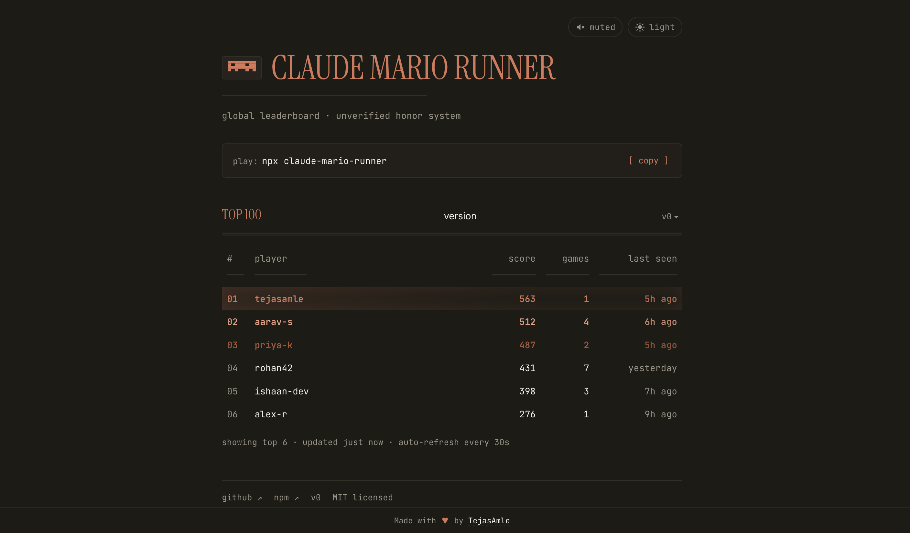

# claude-mario-runner

[](https://www.npmjs.com/package/claude-mario-runner)
[](https://github.com/TejasAmle/claude-mario-runner/actions/workflows/ci.yml)
[](./LICENSE)
[](https://claude-mario-runner.vercel.app)

A Chrome-dino-style infinite runner that lives in your terminal. Claude Code themed — dodge bugs, merge conflicts, walls, exceptions, and drones.

🏆 **Leaderboard:** https://claude-mario-runner.vercel.app &nbsp;·&nbsp; 📦 **npm:** https://www.npmjs.com/package/claude-mario-runner &nbsp;·&nbsp; 📝 **Blog:** [I built and shipped a game this weekend](https://medium.com/@tejas_amle/i-built-and-shipped-a-game-this-weekend-thats-not-the-interesting-part-11f4be3d7854) ([mirror](./BLOG.md))

```
score 0                              tier easy                           best  0

                                                                  ████████
                                                                  #o####o#
                                                                  ########
                                                                  # #  # #
──────────────────────────────────────────────────────────────────────────
```

## Install & run

Requires Node.js ≥ 20.

### Play instantly (no install)

```bash
npx claude-mario-runner
```

### Install globally

```bash
npm install -g claude-mario-runner
claude-mario
```

### From source

```bash
git clone https://github.com/TejasAmle/claude-mario-runner.git
cd claude-mario-runner
npm install
npm run build
npm start
```

Or during development (no build step):

```bash
npm run dev
```

## Global leaderboard

[](https://claude-mario-runner.vercel.app)

Live at **[claude-mario-runner.vercel.app](https://claude-mario-runner.vercel.app)** — top scores across the world, light/dark toggle, retro pixel cursor, background chiptune.

Every new personal best auto-submits to the public board. The first time you play, you'll be prompted for a handle (2–24 chars, lowercase letters/digits/dash). Leave it blank to play offline — nothing is submitted.

```bash
claude-mario login <handle>    # set a handle locally
claude-mario login             # sign in with GitHub (gets a ✓ verified badge)
claude-mario whoami            # show current handle + identity
claude-mario leaderboard       # print the current top scores
claude-mario submit-disable    # opt out of submissions
claude-mario logout            # clear local profile
```

If the network is down when you hit a new best, the submit is parked in a local queue (`~/.claude-mario-runner/submit-queue.jsonl`) and retried the next time you launch the game.

The profile lives at `~/.claude-mario-runner/profile.json` (mode `0600`). A GitHub access token is only stored there after `login` (scope: `read:user`).

## Controls

| Key                 | Action                |
| ------------------- | --------------------- |
| `Space` / `↑` / `W` | Jump                  |
| `↓` / `S`           | Crouch (hold)         |
| `Enter`             | Start / retry         |
| `Q` / `Esc`         | Quit                  |

## Obstacles

| Kind        | Glyph | Size  | Clear by     | Appears in          |
| ----------- | ----- | ----- | ------------ | ------------------- |
| `bug`       | `██`  | 2×1   | Jump         | Easy+               |
| `conflict`  | `▓▓▓` | 3×2   | Jump         | Easy+               |
| `wall`      | `██`  | 2×3   | Jump         | Medium+             |
| `exception` | `▒▒▒` | 3×3   | Jump         | Hard+               |
| `drone`     | `◆`   | 4×10  | **Crouch**   | Medium+             |

Drones are aerial — they hover right through the full jump arc, so jumping won't save you. You have to duck.

## Difficulty tiers

| Tier   | Starts at | Speed | Min gap | Max gap | Aerial prob | Adds       |
| ------ | --------- | ----- | ------- | ------- | ----------- | ---------- |
| easy   | 0 s       | 22    | 30      | 46      | 0%          | bug, conflict |
| medium | 30 s      | 26    | 22      | 34      | 18%         | + wall, drone |
| hard   | 75 s      | 38    | 16      | 26      | 25%         | + exception |
| insane | 120 s     | 52    | 12      | 20      | 32%         | all |

Speed eases smoothly between tiers — no teleport at boundaries.

## Jump physics

Tuned to feel like Chrome's T-Rex dino, with a bias toward longer horizontal glide:

- Peak height ≈ **10 cells** (~2.5× mascot height)
- Airtime ≈ **0.83 s**
- Horizontal reach at easy speed ≈ **18 cells**
- Collision hitbox is **6 wide**; visual sprite is 8 wide (the `# #  # #` leg-gap row is visual only, same trick Chrome dino uses)

While airborne, the mascot is above every ground obstacle — multiple can pass safely under a single jump. Only the drone extends into the jump arc.

## Development

```bash
npm run dev         # run with tsx, no build
npm run typecheck   # tsc --noEmit
npm run lint        # eslint
npm test            # vitest run
npm run test:watch  # vitest
npm run build       # tsup → dist/
npm run format      # prettier --write
```

### Clearability simulation

`scripts/clearability-sim.ts` sweeps every obstacle at every tier speed across every reasonable jump-timing, and reports whether it's jumpable / crouchable / survivable-while-standing. Used to verify the jump tuning whenever physics change.

```bash
npx tsx scripts/clearability-sim.ts
```

### Reproducible runs

Pass a seed to get a deterministic obstacle sequence (useful for debugging):

```bash
npm start -- --seed 42
```

## Architecture

```
src/
├── engine/        # renderer, input, main loop, terminal alt-screen
├── game/          # physics, runner, obstacles, world (tiers + spawning), score
├── assets/        # sprite/glyph definitions
├── net/           # leaderboard submit, offline queue, GH device-flow, profile
├── app.ts         # state machine: title → playing → gameover
├── cli.ts         # subcommand dispatch (login, whoami, leaderboard, …)
└── index.ts       # entry point

web/               # Next.js app deployed to Vercel — API + leaderboard page
├── app/           # / (leaderboard UI) + /api/submit + /api/leaderboard
└── lib/           # Redis keys, rate limits, validation, types
```

- **Fixed 30 Hz timestep** for deterministic physics across terminals
- **Seeded PRNG** (mulberry32) for reproducible obstacle sequences
- **AABB collisions** — hitbox smaller than sprite for forgiving play
- **Time-based tiering** on `elapsedSec`, not distance, so difficulty ramps at real-world seconds regardless of terminal width

## License

MIT © Tejas Amle
